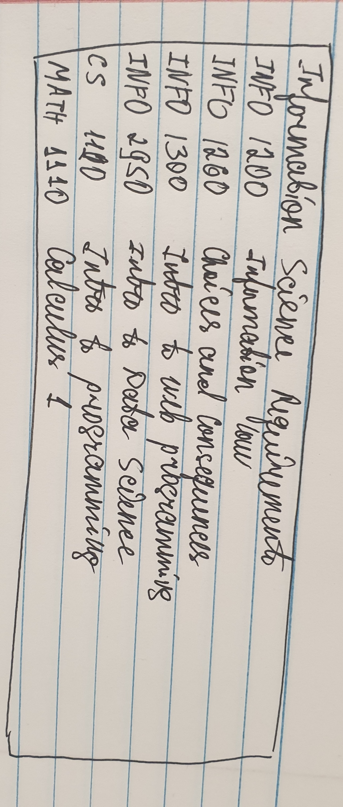

# Project 2: Design Journey

**For each milestone, complete only the sections that are labeled with that milestone.** Refine all sections before the final submission.

You are graded on your design process. If you later need to update your plan, **do not delete the original plan, rather leave it in place and append your new plan _below_ the original.** Then explain why you are changing your plan. Any time you update your plan, you're documenting your design process!

**Replace ALL _TODOs_ with your work.** (There should be no TODOs in the final submission.)

Be clear and concise in your writing. Bullets points are encouraged.

**Everything, including images, must be visible in _Markdown: Open Preview_.** If it's not visible in the Markdown preview, then we can't grade it. We also can't give you partial credit either. **Please make sure your design journey should is easy to read for the grader;** in Markdown preview the question _and_ answer should have a blank line between them.


## Design Plan (Milestone 1)

**Make the case for your decisions using concepts from class, as well as other design principles, theories, examples, and cases from outside of class (includes the design prerequisite for this course).**

You can use bullet points and lists, or full paragraphs, or a combo, whichever is appropriate. The writing should be solid draft quality.


### Catalog (Milestone 1)
> What will your catalog website be about? (1 sentence)

catalog topic: Graduation requirements for Information Science majors


### Audience (Milestone 1)
> Briefly explain your site's audience. Your audience should be specific, but not arbitrarily specific. (1 sentence)
> Justify why this audience is a **cohesive** group. (1-2 sentences)

site audience:

Cornell students who major in (plan to major in) Information Science

why is this a _cohesive_ audience?

This is a cohesive audience because they all have the same goal: to graduate with the information science degree and they all have the same needs and requirements from this website which is to learn about all the requirements.


### Audience Goals (Milestone 1)
> Document your audience's goals for using this catalog website.
> List each goal below. There is no specific number of goals required for this, but you need enough to do the job (Hint: It's more than 1. But probably not more than 3.)
> **Hint:** Users will be able to view all entries in the catalog and insert new entries into the catalog. The audience's goals should probably relate to these activities.

Goal 1: Check all the courses to declare the information science major.

- **Design Ideas and Choices** _How will you meet those goals in your design?_
  - design ideas (1-2 sentences)
  - Create a table with all the courses that will have a field indicating weather or not the course is required in order to affiliate with the information science major.
- **Rationale & Additional Notes** _Justify your decisions; additional notes._
  - rationale  (1-2 sentences)
  - Having a field in a table that would indicate if the course is required for declaring the major or not is important because unlike all the other major requirements (requirements that are mandatory for graduation), the requirements for affilliation are more time=sensitive. Students are required to declare their major by the end of the sophomore year, hence they need to know certainly which courses they need to prioritize taking sooner.

Goal 2: TCheck all the courses that are required in order to graduate with the degree.

- **Design Ideas and Choices** _How will you meet those goals in your design?_
  - design ideas (1-2 sentences)
  - I wil have all the courses listed in the table for the students to see every course (type of course) required to graduate. I will have fields for department code(s), as many information science courses are also cross-listed with other departments, the course number, the pre-reqs and the description of the course. Additionally, I will create a field that indicated for requirement group the course belongs to.
- **Rationale & Additional Notes** _Justify your decisions; additional notes._
  - rationale (1-2 sentences)
  - Having different fields for each course makes it easier to process the course information. For example, having listed all the departments that a course belongs to would let the student know that even though they took a course under another department's code, it could still count for the information science major.

Goal 3: Check if the courses they have taken / they are taking are included in any of the sections within the major requirements.

design ideas and rationale:
We are not allowed to do searching and filtering for this project, however, if we were, that design choice would be the one to allow the students to look up their courses and see if they qualify for the major requirements.


### Audience Device (Milestone 1)
> How will your audience access this website? From a narrow (phone) or wide (laptop) device?
> Justify your decision. (1 sentence)

Taudience device: Wide device

Audience device justification: Looking at data/list/table is easier on a wide screen because the wide screen is bigger and hence reading on a bigger screen is easier.


### Persona (Milestone 1)
> Use the goals you identified above to develop a persona of your site's audience.
> Your persona must have a name and a face. The face can be a photo of a face or a drawing, etc.

persona's face:

The image is downloaded from Pinterest.

persona name: Ann

**Factors that Influence Behavior:**

summary of the persona's factors that influence their behavior (1-2 bullet points):
- Academic courses: lectures, homework, academic requirements, and grades
- Extracuricular activities in university
- On-campus Job

**Goals:**

summary of persona's goals (1-2 bullet points):
- Ann wants to graduate with the information science degree
- Ann wants to work as a data scientist or a software engineer

**Obstacles:**

summary of persona's obstacles (1-2 bullet points):
- Ann needs to fulfill all the major requirements
- Ann needs to find her first internship to launch a job later

**Desires:**

summary of persona's desires (1-2 bullet points):
- Amm desires to fulfill her major requirements in the most optimal way possible
- Ann wants to take other courses that are not neccessary required for the information science major


### Catalog Data (Milestone 1)
> Using your persona, identify the data you need to include in the catalog for your site's audience.
> Justify why this data aligns with your persona's goals. (1 sentence)

list the data your persona will need to effectively use the catalog:
- Course name
- Course code
- Course Department
- Requirement type
- Pre-reqs
- Course description

Justify why this data aids the persona with their goals.
- Ann wants to know the requirements hence having all the courses that she is required to take and that she can potentially take will help her create her schedule and graduate with the degree. For the requirements that she can choose from a group of courses, she will need the course descriptions to pick the ones that she thinks are the most suitable for her and also she wil need the course information to enroll in those courses. Additionally, she will need the pre requisite information to plan that in her schedule as well and she will need to know which requirement type the specific courses fall into for her to plan her major accordingly and in a balanced and optional way.


### Site Design (Milestone 1)
> Design your catalog website to address the goals of your persona.
> Sketch your site's design:
>
> - These are **design** sketches, not _planning_ sketches.
> - Use text in the sketches to help us understand your design.
> - Where the content of the text is unimportant, you may use squiggly lines for text.
> - **Do not label HTML elements or annotate CSS classes.** This is not a planning sketch.
>
> Provide a brief explanation _underneath_ each sketch. (1 sentence)
> **Refer to your persona by name in each explanation.**

sketch(es) + explanation:


This sketch contains filters and a search field, which we shouldn't use for this project but these are common practices when presenting a data in a table format.


This sketch contains the title of the table and all the relevant fields.


### Catalog Design Patterns (Milestone 1)
> Explain how you used design patterns for online catalogs in your site's design. (1-2 sentences)

design pattern explanation:
I sketched a dataset that looks like a table. There are no vertical lines - only horizontal lines. The horizontal line should ideally be below the field name which will be corrected for the next milstone. I am planning to have a light background for the table which is also a design pattern for a table. A good design pattern for a table is that the background color varies so that it is easier to differentiate between the rows. In the sketches it is not aparent but that is also something that I have planned to implement. As we covered during the lecture some design patterns for a table data are a search field and filters, as well as no pagination. Although one of my designs contains filtering and searching I know that it will be implemented for the last project instead. For this table I will need to add the insert field which will be updated.


## Implementation Plan (Milestone 1, Milestone 2)

**Provide enough detail in your plan that another 2300 student could implement your plan.**

### Database Schema (Milestone 1)
> Plan the structure of your database. You may use words or a picture.
> A bulleted list is probably the simplest way to do this.
> Make sure you include constraints for each field.

Table: COURSES

- ID: INTEGER {NN, U, PK, AI},
- NAME: TEXT {NN, U},
- TYPE: INTEGER {NN}
- DEPARTMENT: TEXT {NN}
- CODE: INTEGER {NN}
- DESCRIPTION: TEXT {}
- PRE-REQ: TEXT {}


### Database Query Plan (Milestone 1, Final Submission)
> Plan your database queries.
> You may use natural language, pseudocode, or SQL.

1. All Records (Milestone 1)

    ```
    SELECT * FROM courses
    ```

2. Insert Record (Final Submission)

    ```
    TODO: insert query
    ```


### From Validation (Milestone 2)
> Plan the validation criteria for each piece of form data.

-  name
  - Not empty (Not Null)
- type
  - "chosen"
- department
  - Not Null
- code
  - Not Null
- description
  - Not Null
- pre-requisits
  - No criteria


### Form Planning (Milestone 2)
> Plan your form validation using **pseudocode**.

```
form_valid = True
If sumbitted:
  If name=='':
    form_valid=False
    Show error message for nane
  If !type:
    form_valid=False
    Show error message for type
  If department=='':
    form_valid=False
    Show error message for department
  If code=='':
    form_valid=False
    Show error message for code
  If description=='':
    form_valid = False
    Show error message for description
```


### Form Test Data (Milestone 2)
> For each piece of form data, provide samples of valid and invalid data for testing.

**Valid Test Data:**

- name: "Introduction to Web Programming and Design"
- type: "Core"
- code: 1300
- department: "INFO"
- description: "This class is an introduction to wev programming and design."

**Invalid Test Data:**

- name: '', 123, '123'
- type: not checked - ''
- department: ''
- code: 'ababa', '', 0
- description: ''


## Complete & Polished Website (Final Submission)

### Accessibility Audit (Final Submission)
> Tell us what issues you discovered during your accessibility audit.
> What do you do to improve the accessibility of your site?

TODO: audit fixes


### Self-Reflection (Final Submission)
> Reflect on what you learned during this assignment. How have you improved from Project 1? What would you do differently next time? (2-3 sentences)

TODO: reflection


> Take some time here to reflect on how much you've learned since you started this class. It's often easy to ignore our own progress. Take a moment and think about your accomplishments in this class. Hopefully you'll recognize that you've accomplished a lot and that you should be very proud of those accomplishments! (1-3 sentences)

TODO: reflection


### Collaborators (Final Submission)
> List any persons you collaborated with on this project.

TODO: list your collaborators


### Reference Resources (Final Submission)
> Please cite any external resources you referenced in the creation of your project.
> (i.e. W3Schools, StackOverflow, Mozilla, etc.)

TODO: list reference resources
